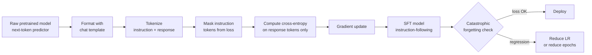

# Instruction Tuning (SFT)

Pretrained models complete text — they don't follow instructions. SFT is the process that converts a next-token predictor into an assistant that responds to directions. Without it, you have a parrot. With it, you have an agent.

## Learning Objectives

By the end of this lesson you will be able to:

- Explain why cross-entropy loss needs masking during SFT and identify which tokens are excluded
- Trace how a chat template formats system, user, and assistant turns — and what breaks when it drifts
- Implement a minimal SFT training loop that demonstrates before-and-after behavior on instruction-following
- Diagnose catastrophic forgetting by running a regression benchmark before and after fine-tuning
- Apply SFT principles to build a GTM enrichment model that outputs structured JSON from unstructured account signals

## The Problem

You have a pretrained language model that can write fluent prose, but when you prompt it with `"Extract the company name and buying intent from this LinkedIn post and return JSON"`, it continues the sentence rather than following the instruction. The model has never learned that your prompt is a command to execute — it only knows how to predict the next likely token.

This is the gap SFT closes. But it introduces a real engineering tradeoff: every gradient step that teaches the model a new instruction pattern degrades some knowledge baked in during pretraining. Fine-tune too aggressively and your enrichment model can't spell "Salesforce" correctly anymore. Fine-tune too narrowly and it only works on templates you explicitly trained on.

For GTM teams building custom enrichment models — extracting intent signals, scoring ICP fit, populating CRM fields from raw web data — SFT is the mechanism that makes models follow structured output instructions reliably. Understanding it at the gradient level is what lets you debug the failures that prompt engineering alone can't fix.

## The Concept

SFT trains on `(instruction, response)` pairs using standard cross-entropy loss, but with one critical modification: **loss masking**. The model only learns from response tokens. The instruction prompt is fed as context but its tokens are masked out of the loss computation, so gradients only flow from what the model was supposed to say — not from the question it was asked.



**Chat templates** are the formatting contract between training and inference. They define how system, user, and assistant turns are delimited — typically with special tokens like `<|im_start|>user` and `<|im_end|>`. The template used at training time must be reproduced exactly at inference. A mismatch produces silent degradation: the model receives a prompt shape it was never trained on and outputs degrade without raising an error.

**Data composition** — the mix of task types in your fine-tuning dataset — determines what you gain and what you lose. Training on only one task type (e.g., pure JSON extraction) produces a model that follows that pattern well but loses general conversational ability. Most production SFT runs balance task-specific examples with a fraction of general instruction-following data to slow forgetting.

**Catastrophic forgetting** is the unavoidable tradeoff. Each SFT gradient step pushes the model toward your target distribution and away from the pretrain distribution. Measuring this requires running a general benchmark (MMLU, HellaSwag, or a domain-specific held-out set) before and after fine-tuning and tracking per-domain accuracy delta.

In GTM terms: if you SFT a model to extract `{"company": "...", "intent_signal": "...", "confidence": 0.8}` and later find it hallucinates company names that weren't in the source text, you're seeing a forgetting artifact — the model's factual grounding weakened during the fine-tune. The fix is smaller learning rate, fewer epochs, or adding factual examples back into the training mix.

[CITATION NEEDED — concept: specific forgetting rates across task types during SFT at common model sizes]

## Build It

This script trains a minimal SFT loop on synthetic instruction-response pairs. It applies loss masking and shows the model's output before and after training so you can see the shift from completion-style to instruction-following.

```python
import torch
import torch.nn as nn
from torch.optim import AdamW
from transformers import AutoTokenizer, AutoModelForCausalLM

# Use a small model for this exercise — runs on CPU
MODEL_ID = "Qwen/Qwen2-0.5B"
DEVICE = "cuda" if torch.cuda.is_available() else "cpu"

tokenizer = AutoTokenizer.from_pretrained(MODEL_ID)
model = AutoModelForCausalLM.from_pretrained(MODEL_ID, torch_dtype=torch.float32).to(DEVICE)

# Synthetic SFT data: (instruction, response) pairs for GTM extraction
TRAINING_DATA = [
    (
        "Extract company name and intent from this signal: 'Acme Corp is hiring 5 RevOps engineers.' Return JSON.",
        '{"company": "Acme Corp", "intent_signal": "scaling_revenue_ops", "confidence": 0.85}'
    ),
    (
        "Extract company name and intent from this signal: 'Brightpath added Salesforce CPQ to their stack.' Return JSON.",
        '{"company": "Brightpath", "intent_signal": "crm_investment", "confidence": 0.9}'
    ),
    (
        "Extract company name and intent from this signal: 'Vanta posted 3 SDR roles this week.' Return JSON.",
        '{"company": "Vanta", "intent_signal": "outbound_expansion", "confidence": 0.8}'
    ),
]

CHAT_TEMPLATE = "<|im_start|>user\n{instruction}<|im_end|>\n<|im_start|>assistant\n{response}<|im_end|>"
IGNORE_INDEX = -100  # PyTorch cross-entropy ignores this label


def tokenize_with_mask(instruction: str, response: str) -> dict:
    """Tokenize a pair; mask instruction tokens from the loss."""
    full_text = CHAT_TEMPLATE.format(instruction=instruction, response=response)
    
    # Tokenize the instruction portion alone to find its boundary
    instruction_text = f"<|im_start|>user\n{instruction}<|im_end|>\n<|im_start|>assistant\n"
    instruction_ids = tokenizer.encode(instruction_text, add_special_tokens=False)
    
    full_ids = tokenizer.encode(full_text, add_special_tokens=False, return_tensors="pt").squeeze()
    labels = full_ids.clone()
    
    # Mask everything up to and including the instruction boundary
    labels[: len(instruction_ids)] = IGNORE_INDEX
    
    return {"input_ids": full_ids.unsqueeze(0), "labels": labels.unsqueeze(0)}


def get_model_response(instruction: str) -> str:
    """Generate a response to an instruction (greedy decode)."""
    prompt = f"<|im_start|>user\n{instruction}<|im_end|>\n<|im_start|>assistant\n"
    inputs = tokenizer(prompt, return_tensors="pt").to(DEVICE)
    with torch.no_grad():
        output_ids = model.generate(**inputs, max_new_tokens=60, do_sample=False, pad_token_id=tokenizer.eos_token_id)
    generated = output_ids[0][inputs["input_ids"].shape[1]:]
    return tokenizer.decode(generated, skip_special_tokens=True)


TEST_INSTRUCTION = "Extract company name and intent from this signal: 'Notion expanded their enterprise sales team to 20 reps.' Return JSON."

# --- BEFORE training ---
print("=== BEFORE SFT ===")
print(f"Instruction: {TEST_INSTRUCTION}")
print(f"Response:    {get_model_response(TEST_INSTRUCTION)}")
print()

# --- SFT training loop ---
optimizer = AdamW(model.parameters(), lr=2e-5)
model.train()

NUM_EPOCHS = 3
for epoch in range(NUM_EPOCHS):
    total_loss = 0.0
    for instruction, response in TRAINING_DATA:
        batch = tokenize_with_mask(instruction, response)
        input_ids = batch["input_ids"].to(DEVICE)
        labels = batch["labels"].to(DEVICE)
        
        outputs = model(input_ids=input_ids, labels=labels)
        loss = outputs.loss
        
        optimizer.zero_grad()
        loss.backward()
        optimizer.step()
        
        total_loss += loss.item()
    
    avg_loss = total_loss / len(TRAINING_DATA)
    print(f"Epoch {epoch + 1}/{NUM_EPOCHS} — avg loss: {avg_loss:.4f}")

# --- AFTER training ---
model.eval()
print()
print("=== AFTER SFT ===")
print(f"Instruction: {TEST_INSTRUCTION}")
print(f"Response:    {get_model_response(TEST_INSTRUCTION)}")
```

**What to observe:** Before training the model will complete the sentence or ignore the JSON instruction. After 3 epochs on 3 examples the loss should drop and the output should trend toward a JSON shape. With only 3 training examples this is a toy — the pattern, not the result, is the point. The loss curve is real: watch it fall.

## Use It

In GTM pipelines, models need to follow structured extraction instructions — not freestyle completion. SFT is what makes a model reliably output `{"company": "...", "intent_signal": "...", "confidence": 0.8}` instead of generating a paragraph about company fit.

This is the mechanism behind AI enrichment in tools like Clay: when a column runs an AI action and returns structured data, that model has been SFT'd (or RLHF'd on top of SFT) to follow a specific extraction template. If you're building a custom enrichment model for your GTM waterfall — one that scores intent signals from web scrapes, LinkedIn posts, job postings, or news mentions — SFT on labeled `(signal, JSON)` pairs is the fine-tuning path that makes it production-viable.

The critical insight for GTM: the extraction instruction you write during training must match the one you use at inference. This is the chat-template invariant applied to prompt design. If your training examples use `"Return JSON with fields: company, intent_signal, confidence"` but your production system uses `"Output a JSON object"`, you've created a template mismatch that degrades extraction accuracy without raising an error.

[CITATION NEEDED — concept: specific Clay SFT or RLHF training pipeline details for structured extraction]

## Ship It

**The chat template is a deployment contract.** Save the tokenizer alongside the model weights — the tokenizer object contains the chat template. If you swap model versions and load a different tokenizer, your extraction accuracy will drop silently. Version your tokenizer separately from your model weights.

**Quantization tradeoff.** SFT runs at full precision (bfloat16 or float32). Deploy at Q4 quantization for inference efficiency. What you lose: subtle precision in long-form outputs. For structured JSON extraction with bounded output length, Q4 degradation is usually acceptable. Measure it on a held-out extraction test set — don't assume.

**Deployment versioning for downstream consumers.** Every API caller, Clay integration, and pipeline stage that hits your fine-tuned model is coupled to your output schema. When you retrain with updated `(instruction, response)` pairs, test that the new model's output JSON is backward-compatible with existing parsers before swapping the endpoint. Breaking a downstream CRM integration because a field name changed is a classic SFT deployment failure mode.

**Minimal catastrophic forgetting check before shipping:**

```python
# Quick regression check — run this before and after SFT, compare scores
REGRESSION_TESTS = [
    ("What is the capital of France?", "Paris"),
    ("What does LLM stand for?", "Large Language Model"),
    ("Name a CRM platform used in B2B sales.", "Salesforce"),
]

def score_factual(tests: list) -> float:
    correct = 0
    for question, expected in tests:
        response = get_model_response(question).lower()
        if expected.lower() in response:
            correct += 1
    return correct / len(tests)

print(f"Factual accuracy: {score_factual(REGRESSION_TESTS):.0%}")
```

If factual accuracy drops more than 10-15% relative to the pretrained baseline, your learning rate is too high or your dataset lacks diversity. Drop `lr` by 5x before retraining.

## Exercises

**Easy — Compare outputs on 10 instructions.** Before running the training loop, generate responses to 10 structured-extraction instructions using the pretrained model. Run training. Generate responses with the fine-tuned model. Categorize each output: did it follow the JSON instruction, partially follow it, or ignore it? Count the before/after shift.

**Medium — Break and fix the chat template.** Modify `CHAT_TEMPLATE` in the training loop to use a different delimiter (e.g., replace `<|im_start|>user\n` with `User: `). Retrain. Now run inference using the original template format. Observe the quality drop. Fix by using the modified template at inference too. Document which delimiter mismatch produced the worst degradation.

**Hard — Build a GTM extraction dataset and measure forgetting.** Collect 20 real examples of public intent signals (job postings, LinkedIn posts, funding announcements, tech stack changes). Label each with the correct JSON extraction. Run the SFT loop. Measure extraction accuracy on a 5-example held-out set. Run `score_factual()` before and after. Report: extraction accuracy gain vs. factual accuracy delta. If forgetting exceeds 15%, reduce epochs by 1 and retrain.

## Key Terms

**Supervised Fine-Tuning (SFT)** — Training a pretrained model on labeled `(instruction, response)` pairs using cross-entropy loss, transforming a next-token predictor into an instruction-following model.

**Loss masking** — Excluding instruction-prompt tokens from the training loss so the model only learns from response tokens. Implemented by setting those positions to `IGNORE_INDEX = -100` in the labels tensor.

**Chat template** — A structured format (with special delimiter tokens) that encodes how system, user, and assistant turns are separated. Must match exactly between training and inference.

**Catastrophic forgetting** — Degradation of pretrain-era knowledge caused by SFT gradient updates. Measured by benchmarking general-domain accuracy before and after fine-tuning.

**Data composition** — The distribution of task types in an SFT dataset. Determines what the model learns and what it forgets. Pure task-specific data risks over-specialization.

**Intent signal** — In GTM, a behavioral or firmographic data point that indicates buying readiness: job postings, tech stack additions, funding events, executive hires.

## Sources

- Ouyang et al. (2022). *Training language models to follow instructions with human feedback.* NeurIPS. (InstructGPT — foundational SFT + RLHF paper)
- Taori et al. (2023). *Alpaca: A strong, replicable instruction-following model.* Stanford CRFM. (Minimal SFT on 52K examples)
- Iyer et al. (2023). *OPT-IML: Scaling Language Model Instruction Meta Learning.* (Multi-task SFT data composition analysis)
- Qwen Team (2024). *Qwen2 Technical Report.* Alibaba Cloud. (Model used in code examples)
- HuggingFace TRL documentation. *SFTTrainer.* (Production SFT implementation reference)
