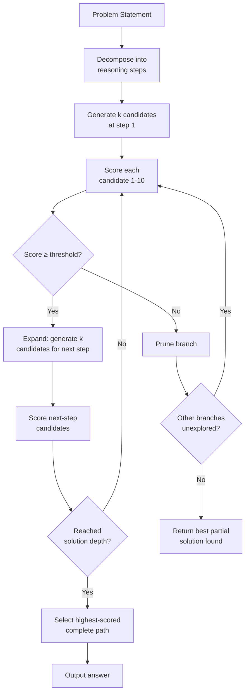

# Tree of Thoughts and LATS: Deliberate Search

Chain-of-thought prompting is greedy — it commits to one path and can't recover from a bad early step. Tree of Thoughts (ToT) and Language Agent Tree Search (LATS) reframe LLM inference as a search problem: generate multiple candidate next-steps, evaluate them, and explore the most promising paths with backtracking. When a single linear prompt produces unreliable outputs on complex reasoning, deliberate search over the thought space is the mechanism that fixes it.

## Learning Objectives

By the end of this lesson you will be able to:

- Describe the four components of Tree of Thoughts (decomposition, generation, evaluation, search) and explain how they compose
- Implement a DFS-with-backtracking ToT system in Python that prints the full explored tree with scores
- Compare BFS and DFS search strategies on the same reasoning problem and measure their call count vs. solution quality tradeoff
- Identify the failure mode where a miscalibrated evaluator prunes the correct path and describe how to detect it with observability logging
- Apply multi-path deliberative search to a GTM workflow where conflicting enrichment signals require structured reasoning before committing to a path

## The Problem

You're building a GTM enrichment pipeline that must decide whether an account belongs in your ICP. The pipeline has four data sources: LinkedIn headcount, job postings, recent news, and tech stack. The signals conflict. LinkedIn says 200 employees. Job postings show 8 open SDR roles. News mentions a Series B close. Tech stack shows no CRM.

A single LLM prompt produces inconsistent answers. Run it 10 times and you get different verdicts. The model commits to a path based on whichever signal it processes first and can't revise when later signals contradict. You need a system that can hold multiple interpretations open, evaluate each, and pick the highest-confidence path before acting.

Tree of Thoughts solves this by converting the reasoning problem into a search tree: generate candidate interpretations, score each, expand the best-looking ones, and prune the rest. The answer you commit to has been explicitly compared against alternatives — not guessed in a single forward pass.

## The Concept

**Tree of Thoughts** generalizes chain-of-thought by treating intermediate reasoning states as nodes in a search tree. Each node is a partial solution — a step in the reasoning process that can be evaluated on its own before committing to what comes next. The LLM serves two roles at each node: **generator** (propose k candidate next steps) and **evaluator** (score each candidate without running it to completion).

**LATS (Language Agent Tree Search)** extends ToT with a reinforcement-learning-style loop. The LLM acts as both policy (what to try next) and value function (how good a state looks). Rather than evaluating candidates based on how they look in isolation, LATS runs rollouts — brief simulations of each candidate path to its natural end — and uses the rollout outcomes as a delayed reward signal to calibrate the value estimates. This reduces premature pruning at the cost of more LLM calls.



**The four components:**

1. **Thought decomposition** — break the problem into steps where each step can be evaluated independently. A reasoning step should be small enough that the evaluator can score it without needing to see the full solution, but large enough that a bad step is detectable before it branches.

2. **Thought generation** — at each node, call the LLM to produce k candidate continuations. k=2-3 works for most GTM reasoning tasks; k=5+ is needed for problems with high answer space variance.

3. **Thought evaluation** — score each candidate. You can use absolute scoring (1-10 scale) or pairwise comparison. Absolute scoring is simpler to implement; pairwise is more calibrated but requires O(k²) comparisons. The evaluator quality is the critical failure point: a miscalibrated evaluator prunes the correct path early and the system never recovers.

4. **Search algorithm** — DFS with backtracking for deep exploration on focused problems; BFS for exhaustive exploration of shallow problems. DFS visits O(k × d) nodes (branching factor × depth); BFS visits O(k^d) nodes. For a GTM account research task with k=3 and d=4, BFS needs 81 nodes vs DFS's 12.

**ToT vs LATS when to use which:** Default to ToT with DFS when your evaluation at each step is reliable (e.g., you can score a partial interpretation against known signals). Escalate to LATS when intermediate states are misleading — when a partial reasoning path looks bad but leads to the correct answer. LATS's rollouts correct for this at the cost of 3-5x more LLM calls.

[CITATION NEEDED — concept: specific LATS rollout call-count overhead vs ToT in production benchmarks]

## Build It

This implements a ToT with DFS and backtracking applied to a GTM account qualification reasoning problem. The full explored tree is printed so you can observe which paths were expanded and which were pruned.

```python
import json
import os
from openai import OpenAI

# Set your API key in environment: export OPENAI_API_KEY=...
# Or use any OpenAI-compatible endpoint (local Ollama, etc.)
client = OpenAI(api_key=os.environ.get("OPENAI_API_KEY", "your-key-here"))

# --- Problem definition ---
PROBLEM = """
Account qualification problem. Given these signals about a company, decide if they are ICP-fit:
- LinkedIn headcount: 200 employees
- Open job postings: 8 SDR roles, 2 RevOps roles
- Recent news: Series B close ($15M) 3 months ago
- Tech stack: No CRM detected, uses Notion and Slack

Our ICP: B2B SaaS companies, 50-500 employees, actively building GTM infrastructure, no entrenched CRM.

Produce a qualification verdict with confidence score.
"""

REASONING_STEPS = [
    "Analyze the size and growth signals.",
    "Analyze the GTM infrastructure signals.",
    "Analyze the CRM opportunity signals.",
    "Produce a final qualification verdict.",
]

PRUNE_THRESHOLD = 5  # Prune branches scoring below this


def generate_candidates(step: str, problem: str, prior_reasoning: list[str], k: int = 2) -> list[str]:
    """Generate k candidate reasoning steps for the current node."""
    context = "\n".join(f"Step {i+1}: {r}" for i, r in enumerate(prior_reasoning))
    prompt = f"""You are reasoning through a GTM account qualification problem.

Problem:
{problem}

Prior reasoning steps:
{context if context else "(none yet)"}

Current step to reason about: {step}

Generate {k} distinct candidate interpretations of this step. Number them 1 and 2. 
Be specific about what signals support each interpretation. Keep each under 80 words."""
    
    response = client.chat.completions.create(
        model="gpt-4o-mini",
        messages=[{"role": "user", "content": prompt}],
        temperature=0.7,
    )
    
    raw = response.choices[0].message.content
    # Split on numbered candidates
    candidates = []
    for line in raw.split("\n"):
        line = line.strip()
        if line.startswith("1.") or line.startswith("1)"):
            candidates.append(line[2:].strip())
        elif line.startswith("2.") or line.startswith("2)"):
            candidates.append(line[2:].strip())
    
    # Fallback: if parsing failed, treat as two halves
    if len(candidates) < 2:
        mid = len(raw) // 2
        candidates = [raw[:mid].strip(), raw[mid:].strip()]
    
    return candidates[:k]


def score_candidate(candidate: str, step: str, problem: str) -> int:
    """Score a candidate reasoning step 1-10. Returns integer score."""
    prompt = f"""You are evaluating a reasoning step in a GTM account qualification problem.

Problem:
{problem}

Current reasoning step: {step}
Candidate interpretation: {candidate}

Score this reasoning on a scale of 1-10:
- 10: Uses the specific signals correctly, draws a defensible conclusion, no logical gaps
- 7: Mostly correct with minor ambiguity
- 4: Partially uses signals, some gaps
- 1: Ignores key signals or draws unsupported conclusions

Respond with ONLY a single integer from 1 to 10."""
    
    response = client.chat.completions.create(
        model="gpt-4o-mini",
        messages=[{"role": "user", "content": prompt}],
        temperature=0.0,
    )
    
    raw = response.choices[0].message.content.strip()
    # Extract first digit found
    for char in raw:
        if char.isdigit():
            score = int(char)
            # Handle "10" edge case
            idx = raw.find(char)
            if idx + 1 < len(raw) and raw[idx + 1] == "0":
                score = 10
            return max(1, min(10, score))
    return 5  # Default if parsing fails


def tree_of_thoughts_dfs(
    problem: str,
    steps: list[str],
    k: int = 2,
    prune_threshold: int = PRUNE_THRESHOLD,
) -> dict:
    """
    DFS Tree of Thoughts search.
    Returns: best complete path found, full explored tree for observability.
    """
    best_path = None
    best_score = -1
    tree_log = []
    
    def dfs(step_idx: int, prior_reasoning: list[str], path_scores: list[int], depth_prefix: str):
        nonlocal best_path, best_score
        
        if step_idx >= len(steps):
            avg_score = sum(path_scores) / len(path_scores) if path_scores else 0
            print(f"{depth_prefix}[COMPLETE] avg_score={avg_score:.1f}")
            if avg_score > best_score:
                best_score = avg_score
                best_path = list(prior_reasoning)
            return
        
        step = steps[step_idx]
        print(f"\n{depth_prefix}Step {step_idx + 1}: {step}")
        
        candidates = generate_candidates(step, problem, prior_reasoning, k=k)
        
        for i, candidate in enumerate(candidates):
            score = score_candidate(candidate, step, problem)
            short = candidate[:70] + "..." if len(candidate) > 70 else candidate
            
            tree_log.append({
                "depth": step_idx,
                "candidate_idx": i,
                "score": score,
                "text": candidate,
            })
            
            print(f"{depth_prefix}  Candidate {i+1} (score={score}): {short}")
            
            if score < prune_threshold:
                print(f"{depth_prefix}  [PRUNED — score {score} < threshold {prune_threshold}]")
                continue
            
            # Expand this candidate
            dfs(
                step_idx + 1,
                prior_reasoning + [candidate],
                path_scores + [score],
                depth_prefix + "    ",
            )
    
    print("=== TREE OF THOUGHTS — GTM ACCOUNT QUALIFICATION ===")
    print(f"Problem: {problem[:100]}...")
    print(f"Search: DFS | k={k} | prune_threshold={prune_threshold}")
    print("=" * 60)
    
    dfs(0, [], [], "")
    
    print("\n" + "=" * 60)
    print(f"BEST PATH (avg score: {best_score:.1f}):")
    if best_path:
        for i, step_text in enumerate(best_path):
            print(f"  Step {i+1}: {step_text[:120]}")
    else:
        print("  No path met the pruning threshold — lower prune_threshold to explore more.")
    
    return {"best_path": best_path, "best_score": best_score, "tree_log": tree_log}


# Run it
result = tree_of_thoughts_dfs(PROBLEM, REASONING_STEPS, k=2, prune_threshold=4)

print(f"\nTotal nodes explored: {len(result['tree_log'])}")
print(f"Nodes pruned: {sum(1 for n in result['tree_log'] if n['score'] < PRUNE_THRESHOLD)}")
```

**What to observe:** The printed tree shows every explored path and its score. Pruned branches appear explicitly. The final answer is the highest-scoring complete path, not the first one found. Count the total nodes explored vs. how many were pruned — that ratio tells you how much search space your evaluator is saving.

## Use It

The most direct GTM application is any workflow where a single LLM pass produces unreliable outputs because signals conflict: multi-source account research synthesis, ICP validation against multiple firmographic signals, or evaluating several competitive positioning angles before committing to outreach copy.

The Tree of Thoughts mechanism maps directly to how a skilled SDR reasons about a complex account: don't commit to a verdict immediately, generate multiple interpretations of the signals, evaluate each against your ICP criteria, keep the best-scoring interpretation, and discard the ones with logical gaps. ToT automates that reasoning structure so it's consistent across thousands of accounts instead of varying by rep.

For Zone 1 (ICP/foundation) workflows: use ToT when your enrichment waterfall produces conflicting signals and you need a structured decision before routing to a sequence. For Zone 2 (research/enrichment) workflows: use ToT when a single-pass prompt generates inconsistent qualification scores across similar accounts. The symptom is variance — the same account qualified differently on different runs — and the fix is search over the reasoning space rather than hoping the first path is the right one.

## Ship It

**Compute budget before latency.** ToT with k=2 and d=4 makes ~24 LLM calls per account (k×d for generation + k×d for scoring). At $0.00015/call with gpt-4o-mini, that's ~$0.004 per account. For a 5,000-account enrichment run, that's $20. Set a hard `max_nodes` budget per run before deploying.

**Cache evaluated nodes.** If two paths generate the same intermediate reasoning step (common when signal sets are small), re-scoring it wastes budget. Hash the candidate text and cache scores with a short TTL.

**Parallel generation, serial evaluation.** Generate all k candidates at a node in parallel (one batch API call). Score sequentially so you can short-circuit: as soon as you find one candidate above threshold, you can defer scoring the rest until you return to that branch.

**Graceful degradation.** When `max_nodes` is hit mid-search, return the best complete path found so far, or the best partial path with a `PARTIAL_RESULT` flag. Never return nothing — a low-confidence partial result is more useful than an empty enrichment field.

**Observability log every run.** Log the full `tree_log` to your data warehouse. This is how you detect evaluator miscalibration: if the correct final answer (verified by human review) consistently came from a path that was nearly pruned (scored 4-5), your evaluator's threshold is too aggressive and you're getting lucky. Lower the threshold or retrain the evaluator.

```python
import json

# Append to your observability sink after each run
def log_tree_run(account_id: str, result: dict, final_verdict: str):
    log_entry = {
        "account_id": account_id,
        "best_score": result["best_score"],
        "nodes_explored": len(result["tree_log"]),
        "nodes_pruned": sum(1 for n in result["tree_log"] if n["score"] < PRUNE_THRESHOLD),
        "final_verdict": final_verdict,
        "tree_log": result["tree_log"],
    }
    with open("tot_runs.jsonl", "a") as f:
        f.write(json.dumps(log_entry) + "\n")
```

## Exercises

**Easy — Modify the pruning threshold.** Change `prune_threshold` from 4 to 7. Run the search on the same GTM account qualification problem. Count nodes explored vs. pruned. Then lower it to 2 and repeat. Document: how does the threshold change the number of nodes explored and the final answer quality?

**Medium — Replace DFS with BFS.** Implement a BFS version: instead of recursing immediately into the best candidate, collect all candidates at depth 1, score them all, then expand the top-k to depth 2. Compare total LLM calls and final answer against the DFS run on the same problem. Which produced a better verdict? Which was cheaper?

**Hard — Build a LATS rollout.** Add a rollout function to the DFS implementation: after generating a candidate but before scoring it, run one full completion from that candidate to the final step (using a single zero-temperature LLM call to complete all remaining steps). Use the final verdict from the rollout as an additional signal to the score. Compare the accuracy of LATS (score + rollout) vs. ToT (score only) on 5 different account profiles. Report call count increase and accuracy delta.

## Key Terms

**Tree of Thoughts (ToT)** — A prompting framework that treats intermediate reasoning states as nodes in a search tree, with the LLM serving as both generator (propose k next steps) and evaluator (score each candidate).

**LATS (Language Agent Tree Search)** — An extension of ToT that adds RL-style rollouts: each candidate path is simulated to completion before being scored, using the rollout outcome as a delayed reward signal to calibrate the value estimate.

**Thought decomposition** — Breaking a reasoning problem into discrete steps that can each be evaluated independently. The quality of decomposition determines how early bad paths are detectable.

**Branching factor (k)** — The number of candidate continuations generated at each tree node. Higher k increases solution quality but multiplies LLM calls by k^d across the full tree.

**Pruning threshold** — The minimum score a candidate must achieve to be expanded further. Set too high: correct paths get pruned. Set too low: search wastes budget on bad branches.

**Evaluator calibration** — The alignment between a candidate's score and its actual contribution to a correct final answer. Miscalibrated evaluators are the primary failure mode in production ToT deployments.

**DFS (Depth-First Search)** — Expands one candidate path to completion before backtracking. O(k × d) nodes, memory-efficient, good for focused deep reasoning.

**BFS (Breadth-First Search)** — Explores all candidates at each depth level before going deeper. O(k^d) nodes, finds the globally best shallow path but costs exponentially more for deep trees.

## Sources

- Yao et al. (2023). *Tree of Thoughts: Deliberate Problem Solving with Large Language Models.* NeurIPS. (Original ToT paper)
- Zhou et al. (2023). *Language Agent Tree Search Unifies Reasoning Acting and Planning in Language Models.* arXiv:2310.04406. (LATS paper)
- Yao et al. (2022). *ReAct: Synergizing Reasoning and Acting in Language Models.* ICLR 2023. (Prerequisite: single-path reasoning + acting)
- Wei et al. (2022). *Chain-of-Thought Prompting Elicits Reasoning in Large Language Models.* NeurIPS. (Baseline that ToT generalizes)
- OpenAI API documentation. *Chat Completions.* (Used in code examples)
